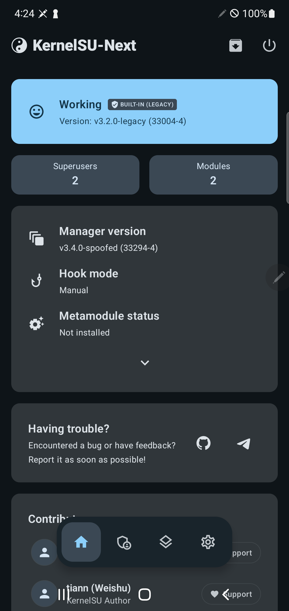

# android_kernel_samsung_exynos9820

Production-grade Samsung Exynos 9820/9825 kernel with integrated KernelSU-Next legacy driver.


<p align="center">
  
</p>

## Why

Stock and community kernel trees for Samsung Exynos 9820/9825 fail when compiling with modern root solutions due to three fundamental blockers:
1. **SAR Ramdisk Freezes:** Upstream boot ramdisk injection corrupts Samsung One UI 4.1 System-as-Root (SAR), causing early bootloader freezes and bootloops.
2. **VFS Deadlock:** Upstream `pkg_observer.c` executes package parsing synchronously inside `fsnotify` callbacks, creating an ABBA deadlock on `i_rwsem` during Android PMS startup.
3. **SoC Nomutanosibligi:** Default configs conflate Exynos 9820 (S10) with Exynos 9825 (Note 10), leading to clock and power-management stalls on `d2xks`.

This repository provides surgical, production-tested fixes for all three issues, enabling stable, out-of-the-box KernelSU-Next legacy execution on One UI 4.1.

## Quick Start

```bash
git clone --depth=1 https://github.com/qsardor/android_kernel_samsung_exynos9820.git -b gorhanhee
cd android_kernel_samsung_exynos9820
./build_kernel.sh d2xks
```

The compiled, Odin-flashable archive will be generated at `prebuilts/N976N_KSUN_33004_Fixed.tar`.

## Features

- **Built-in KernelSU-Next Legacy (33004):** Driver integrated in-tree under `drivers/kernelsu` with manual hook mode.
- **Asynchronous Package Observer:** Replaces synchronous `fsnotify` parsing with non-blocking Linux workqueues (`schedule_work`), eliminating `system_server` uninterruptible sleep (`D` state).
- **Clean SAR Boot:** Preserves stock Samsung SAR rootfs structure with zero ramdisk corruption.
- **Automated Crowning Service:** Includes `tools/ksu_manager_guard/00-crown-manager.sh` to dynamically crown manager UIDs across cold reboots.
- **Single-Command Odin Packaging:** Automatically packages `boot.img`, `dt.img`, and `dtbo.img` into a flashable `.tar`.

## Supported Devices

| Codename | Device | SoC | Defconfig |
| :--- | :--- | :--- | :--- |
| `d2xks` | Galaxy Note 10+ 5G (`SM-N976N`) | Exynos 9825 | `exynos9820-d2xks_defconfig` |
| `d2s` | Galaxy Note 10 (`SM-N970F`) | Exynos 9825 | `exynos9820-d2s_defconfig` |
| `d2x` | Galaxy Note 10+ (`SM-N975F`) | Exynos 9825 | `exynos9820-d2x_defconfig` |
| `beyond1lte` | Galaxy S10 (`SM-G973F`) | Exynos 9820 | `exynos9820-beyond1lte_defconfig` |
| `beyond2lte` | Galaxy S10+ (`SM-G975F`) | Exynos 9820 | `exynos9820-beyond2lte_defconfig` |
| `beyond0lte` | Galaxy S10e (`SM-G970F`) | Exynos 9820 | `exynos9820-beyond0lte_defconfig` |

## Build Environment

- **Architecture:** `arm64` (aarch64)
- **Compiler:** Clang 6.0.1 (`clang-4639204-cfp-jopp`)
- **Cross-Compiler:** GCC 4.9 CFP (`aarch64-linux-android-`)
- **Target OS:** Android 12 (One UI 4.1)

## Credits

Created together by **Antigravity** & **Q.S@RDOR**.

## License

This project is licensed under the [GNU General Public License v2.0](LICENSE).
